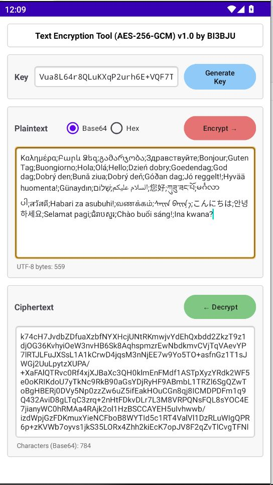

# AES-256-GCM Text Encryption Tool (Android)

---

## Screenshots

| Main |
| :---: |
|  |

### 📖 Introduction

**AES-256-GCM Text Encryption Tool (Android)** is a lightweight Android application built with Kotlin, designed to securely encrypt and decrypt arbitrary Unicode text.  
It uses the industry-standard AES-256-GCM authenticated encryption algorithm, supports both Base64 and Hex output formats, and automatically detects the encoding of input ciphertext on decryption — making it extremely easy to use.

Developed by BI3BJU, this open-source project is ideal for personal privacy protection, password management assistance, and more.

### ✨ Features

- ✅ AES-256-GCM encryption – ensures confidentiality, integrity, and authenticity
- 🔑 Flexible key input – accepts any text (derived via SHA-256) or a 32-byte Base64 random key (recommended)
- 🎲 One-click random key generation – uses a system-secure RNG and auto-copies to clipboard
- 📋 Automatic clipboard integration – results are copied to clipboard after encryption/decryption
- 🔄 Output format switch – choose Base64 or Hex for encryption
- 🔍 Auto-detection of ciphertext format – no need to select Base64 or Hex manually when decrypting
- 📊 Real-time statistics – shows UTF-8 byte count of plaintext and ciphertext length (characters for Base64, bytes for Hex) based on current format
- 🖱️ Long-press context menu – supports copy, paste, cut, select all, clear, and quick actions: Encrypt current / Decrypt current / Generate key
- 🛡️ Error-aware decryption – shows friendly messages for wrong keys or corrupted data
- 🌐 Cross-platform interoperability – compatible with the Python desktop client

### 🚀 Quick Start

#### Requirements

- Android Studio (latest stable)
- JDK 11+
- Android SDK (API 21+)

#### Installation

1. Clone the repository: `git clone https://github.com/BI3BJU/Text-Encryption-Tool-Java.git`
2. Open the project in Android Studio.
3. Run it on an emulator or a physical device.

### 🧩 Usage Guide

1. **Key**
   - Enter any arbitrary text (e.g., a passphrase); the app derives a 32-byte key using SHA-256.
   - It is highly recommended to tap **Generate Key** to obtain a high-entropy Base64 random key and store it securely.

2. **Encryption**
   - Type your plaintext in the **Plain Text** field.
   - Choose output format: **Base64** or **Hex**.
   - Tap **Encrypt** – the ciphertext appears in the **Cipher Text** field and is automatically copied to the clipboard.
   - Ciphertext length statistics update accordingly.

3. **Decryption**
   - Paste the ciphertext (Base64 or Hex, automatically detected) into the **Cipher Text** field.
   - Ensure the correct key is entered.
   - Tap **Decrypt** – upon success, the plaintext is displayed and copied to the clipboard.

4. **Real-time statistics**
   - Below the plaintext area, the UTF-8 byte count is shown.
   - Below the ciphertext area, the length is displayed: characters for Base64, bytes for Hex.

5. **Context menu**
   - Long-press inside any text field to open a context menu for copy, paste, cut, select all, clear, and quick encryption/decryption/key-generation actions.

### 🔒 Security Notes

- Algorithm: AES-256-GCM (Galois/Counter Mode) – an authenticated encryption mode that detects tampering and wrong keys.
- Nonce: A fresh 12-byte nonce is generated for each encryption using `SecureRandom`, ensuring that identical plaintexts yield different ciphertexts.
- Key derivation: SHA-256 is used to hash any input into a 32-byte key. Strongly recommended: use the high-entropy Base64 key generated by **Generate Key**, rather than a simple password, to resist dictionary attacks.
- Data safety: The key exists only in memory; the app does not save any data to disk unless you manually copy it out.
- Error handling: Decryption failures show a generic “wrong key or corrupted data” message, avoiding internal state leakage.

### 🛠️ Technology Stack

- Language: Kotlin
- Cryptography: Java Cryptography Extension (JCE) – `AES/GCM/NoPadding`
- Key Derivation: SHA-256 via `MessageDigest`
- Encoding: `Base64` and custom Hex converter
- UI: Android XML layouts with `AppCompat` and `WindowInsets` handling

### 📁 Project Structure

- `app/src/main/java/...` — Kotlin source code
- `app/src/main/res/layout/...` — Android XML layouts
- `app/src/main/res/values/...` — strings and theme resources
- `build.gradle(.kts)` — build configuration
- `README.md` — this documentation
- `LICENSE` — MIT License

### 📝 Changelog

- v1.0 – First stable release with AES-256-GCM encryption/decryption, Base64/Hex output, clipboard integration, real-time statistics, long-press context menu, and cross-platform interoperability.

### 👤 Author

BI3BJU – Amateur radio enthusiast & open-source developer

### 📄 License

This project is licensed under the MIT License – see the [LICENSE](LICENSE) file for details.

## 🌐 Cross-Platform Interoperability

The **Android client** provided in this project and the **Python client (https://github.com/BI3BJU/Text-Encryption-Tool-Python)** share a fully consistent and aligned underlying encryption architecture.  
This means: **Ciphertext encrypted on the Python side can be directly decrypted on the Android side, and vice versa.**

### 🔐 Core Encryption Standards

Both implementations strictly adhere to the following mathematical and cryptographic specifications during encryption and decryption:

1. **Key Derivation**:
   Both sides utilize the **SHA-256** algorithm. User-provided passwords of any length are first converted into a `UTF-8` byte stream and then derived into a fixed **32-byte (256-bit)** strong key for subsequent AES encryption.
2. **Encryption Algorithm**:
   Uses the industry-standard **AES-256-GCM** authenticated encryption mode (configured with `NoPadding` and a **128-bit / 16-byte** authentication tag).
3. **Random Nonce/IV**:
   For every encryption operation, a fresh **12-byte Nonce** is generated using a system-level cryptographically secure random number generator (Python's `os.urandom` and Android's `SecureRandom`). Consequently, even if the password and plaintext remain identical, the resulting ciphertext differs every time.

---

### 📦 Ciphertext Data Structure

To ensure seamless interoperability of the binary data generated by both clients, the ciphertext undergoes strict byte concatenation prior to transmission or display. Regardless of whether the format is Base64 or Hex (hexadecimal), the structure of the unpacked raw binary byte stream is as follows:

| Byte Range | Data Type | Purpose |
| :--- | :--- | :--- |
| `0 ~ 11` (First 12 bytes) | **Nonce (IV)** | Initialization Vector; used to prevent replay attacks and ensure ciphertext uniqueness |
| `12 ~ End` (Remaining bytes) | **Ciphertext + Auth Tag** | The actual encrypted ciphertext followed by the 16-byte GCM authentication tag |

During decryption, the programs on both ends automatically slice the input to read the first 12 bytes as the Nonce, while extracting the remaining bytes as the ciphertext and tag for integrity verification and decryption.

---

### 🔄 Transmission Format Support

Both programs feature a built-in **ciphertext format auto-detection engine**. When you copy the ciphertext for decryption, there is no need to manually select the input format; the tool automatically identifies and parses the following two encoding formats:

- **Base64 string** (e.g., `aBc1...==`)
- **Hex / Hexadecimal string** (e.g., `61626331...`)

### Disclaimer

This app is provided as-is for experimental and educational purposes. The author is not responsible for any misuse or damage caused by this software.